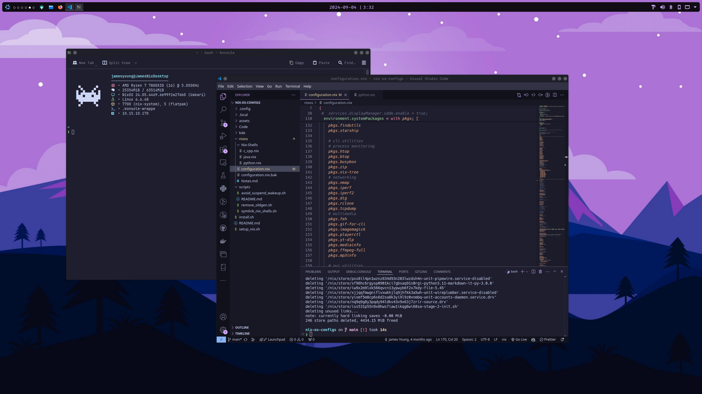
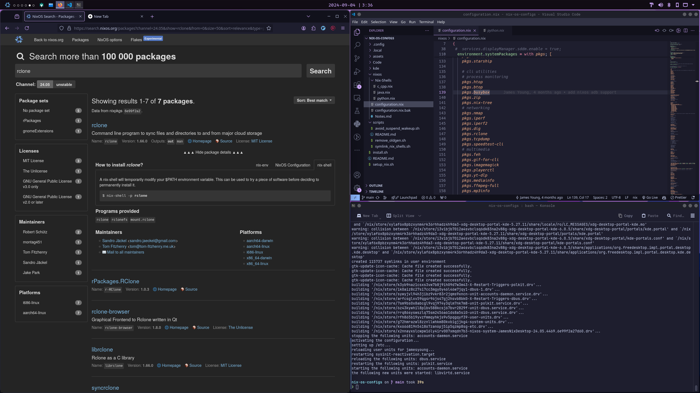
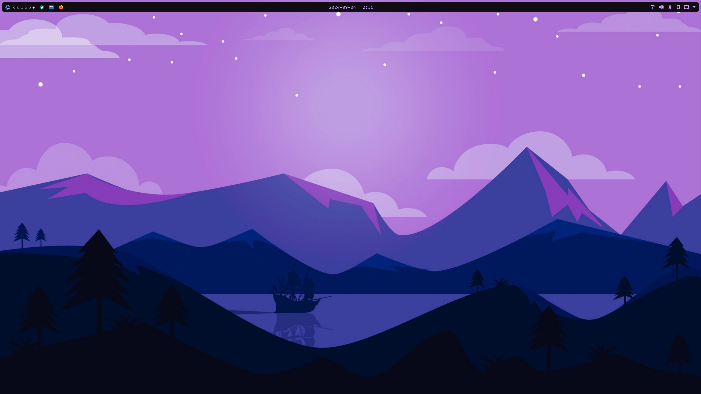

# James' Nix Config

My Nix config using Nix flakes and home manager. Currently use NixOS on my personal laptop and desktop, both using KDE Plasma 6 as DE.

## Preview







## Setup

Install NixOS, then enable `nix-command` & `flakes` by adding `nix.settings.experimental-features = [ "nix-command" "flakes" ];` to `/etc/nixos/configuration.nix` and run `sudo nixos-rebuild switch`.

Remember if changing hardware (eg. changing SSD) of a machine rebuild the `hardware-configurations.nix`, then replace it in `hosts`.

Below shows an example of deploying flake with main desktop host, replace `.#main-desktop` for other machines listed in hosts.

``` bash
sudo nixos-rebuild switch --flake .#main-desktop
```

### Other Setup

I have some `scripts` for setting up things that I am too lazy or can't use Nix to setup, remember to `chmod +x` the scripts.

``` bash
# setup and install flatpaks
./scripts/flatpak-setup.sh

# if backing up list of installed flatpaks
./scripts/flatpak-export.sh

# install VSCode extensions
./scripts/install-vscode-extensions.sh

# copy relevant configs to .config
./local-config-setup.sh
```

I know ideally for local configs I should be using home manager to declare the configs like installed VSCode extensions and what not, but I'm too lazy and will leave it for another day.

## System Info

- OS: [NixOS](https://nixos.org/)
- Desktop Environment: [KDE Plamsa 6](https://nixos.wiki/wiki/KDE)
- Diplay Manager: SDDM
- Shell: Bash
- Terminal: [Konsole](https://konsole.kde.org/)
- Tiling: [Krohnkite](https://github.com/anametologin/krohnkite)
- Theme:
  - Global Theme: Breeze Dark
  - Colors: [Catppucin Mocha Lavender](https://github.com/catppuccin/kde)
  - Window Decoration: [Dracula](https://draculatheme.com/)
  - Icons: [Papirus Dark](https://github.com/vinceliuice/Tela-icon-theme)
  - Cursors: [Dracula Cursors](https://draculatheme.com/)
  - Wallpaper: See [here](./assets/PurpleMountain-Wallpaper.jpg)
- KDE Panel Widgets (left to right):
  - [Application Launcher](https://userbase.kde.org/Plasma_application_launchers)
  - [Desktop Indicator](https://store.kde.org/p/2131462)
  - [Icons-only Task Manager](https://userbase.kde.org/Plasma/Tasks/en)
  - [Digital Clock](https://userbase.kde.org/Plasma/Clocks/en)
  - [Panel Colorizer](https://store.kde.org/p/2130967)
  - [System Tray](https://userbase.kde.org/Plasma/SystemTray)
- Font: RobotoMono Nerd Font 10 pt

## Todos

- Reorganize modules to have more modularity for future hosts
- Improve organization of modules
- Move more global system packages to home manager (most don't need to be global)
- MacOS support in case I want/have to use Mac in future
- More template nix-shells for work/dev
